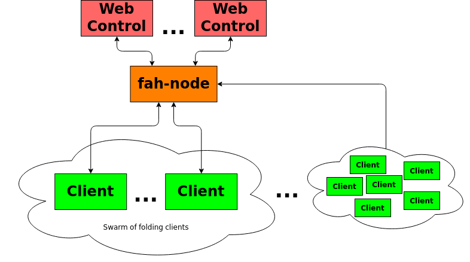

# fah-node
Authenticate, monitor and control your swarm of Folding@home clients remotely

``fah-node`` makes it possible to securely monitor and control swarms of
Folding@home clients remotely, no matter where they are on the Internet.  A node
can be used by more than one user at a time.  Multiple nodes are used to
distribute the network load.

F@H clients can be configured to connect to and attempt to register with a node.
Authorized users can approve nodes via their Folding@home account.  Once
approved nodes will automatically appear on in your account screen.



## Debian Linux Quick Start

### Build
The following commands will build and install fah-node on Debian based Linux
systems.

```sh
sudo apt-get update
sudo apt-get install -y scons build-essential libssl-dev binutils-dev \
  libleveldb-dev libsnappy-dev git nodejs npm bind9-dnsutils ssl-cert

mkdir build
cd build

git clone https://github.com/cauldrondevelopmentllc/cbang
git clone https://github.com/foldingathome/fah-node

export CBANG_HOME=$PWD/cbang

scons -C cbang
scons -C fah-node
scons -C fah-node package
```

### Install

```sh
sudo dpkg -i fah-node/fah-node_$(cat fah-node/version.txt)_amd64.deb
sudo fah-node-ports
sudo apt-get install -y iptables-persistent
```

### Setup
#### Domain name
Add the node's domain name to ``/etc/fah-node/config.xml``.

```xml
  <domains>node.example.com</domains>
```

#### Setup Google OAuth2
Follow these steps to configure OAuth2 logins for your node:

 # Go to https://console.developers.google.com/apis/dashboard
 # Login to your Google account
 # Create a new project
 # Configure the OAuth consent screen
 # Click on ``Credentials`` then ``CREATE CREDENTIALS``
 # Select ``OAuth client ID``
 # Select ``Application type``: ``Web application``
 # Give your OAuth application a name
 # Add the ``Authorized JavaScript origin``: ``https://node.example.com``
 # Add the ``Authorized redirect URI``: ``https://node.example.com/login``
 # Click the ``CREATE`` button
 # Note the ``Client ID`` and ``Client secret``.

Note, Google tends to change the interface fairly often so you may have to
adjust the above described process.

Add the following to your ``config.xml``:

```xml
  <google-client-id>YOUR_CLIENT_ID</google-client-id>
  <google-client-secret>YOUR_CLIENT_SECRET</google-client-secret>
  <google-redirect-base>https://node.example.com</google-redirect-base>
```

#### Add an admin account

Add one or more email addresses which will have admin access to your node:

```xml
  <admins>admin@gmail.com</admins>
```

Note, admin email addresses must match the OAuth login.

#### Complete ``config.xml``
Your ``/etc/fah-node/config.xml`` should look something like this:

```xml
<config>
  <admins>admin@gmail.com</admins>
  <domains>node.example.com</domains>
  <google-client-id>YOUR_CLIENT_ID</google-client-id>
  <google-client-secret>YOUR_CLIENT_SECRET</google-client-secret>
  <google-redirect-base>https://node.example.com</google-redirect-base>
</config>
```

#### Increase system open file limit
As root, edit ``/etc/security/limits.conf``.  Add the following:

    # For F@H AS
    * soft nofile 10240
    * hard nofile 10240
    root soft nofile 10240
    root hard nofile 10240

Logout and back in for new limits to take effect.

#### Start the node
Start the node with:

```
sudo service fah-node start
```

Monitor the log file:

```
sudo tail -F -n 1000 /var/log/fah-node/log.txt
```

#### Login to the node

To login visit your node's web page.  E.g. https://node.example.com/.  Then
click on the protein icon to login.  If everything is setup correctly you should
reach the admin web page.

## Security
